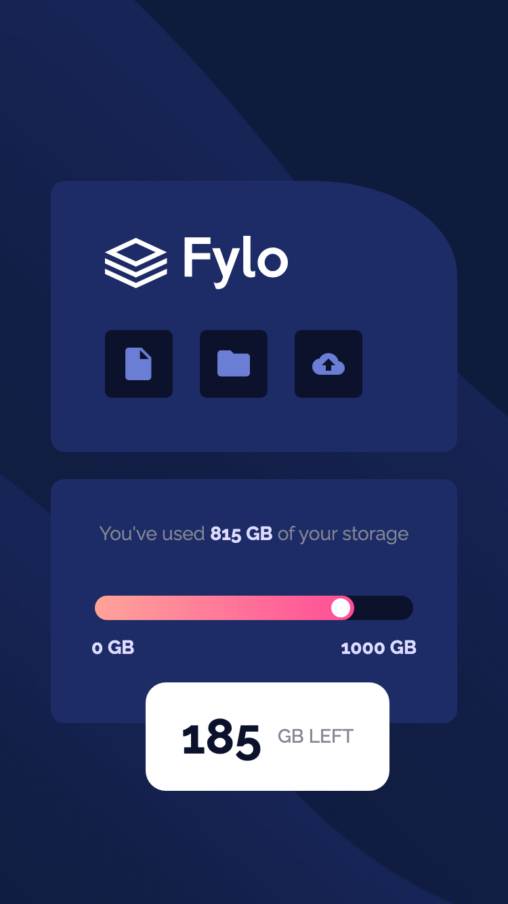

# Responsive Web Design Project - Fylo Data Storage Component
## 目錄
- [總覽](#overview)
  - [專案介紹](#專案介紹)
  - [成品預覽](#畫面預覽)
  - [線上預覽](#線上預覽)
- [製作過程](#製作過程)
  - [使用技術](#使用技術)
  - [我學到的內容](#我學到的內容)
  - [未來要持續精進的部分](#未來要持續精進的部分)
  - [實用資源](#實用資源)

## 總覽

### 專案介紹

這個專案有兩種排版（電腦版及手機版），請使用瀏覽器的檢查功能，調整螢幕寬度來檢視這兩種版型

- 電腦版（1440 px）
- 手機版（375px）
#### [線上預覽](https://jess99978.github.io/fylo-data-storage-component-master/)
### 畫面預覽

  

    
電腦版預覽圖

    
  

  

    
手機版預覽圖

    
  

## 製作過程

### 使用技術
- 語意化的 HTML5 標籤
- SCSS 變數、巢狀結構、MIXINS
- Flexbox
- Bootstrap
- RWD
- Git 版本控制

### 我學到的內容
- HTML 中插入空白的方式與其差異
- [用 css 繪製三角型](https://codepen.io/Jess-the-solid/pen/GRaNvvG)
- SCSS 的 Variables、Nesting、mixin
- 將專案放到 Github Pages，並撰寫 README.md
### 未來要持續精進的部分
- SCSS 的其他進階語法（mixin 中加入變數、extend、functions）
- Bootstrap 的 grid 製作流動式排版

### 實用資源

- [SCSS 教學影片](https://www.youtube.com/watch?v=nu5mdN2JIwM) - 這部 YT 影片內容包括 SCSS 的基本介紹、SCSS/CSS 的轉換，以及實際的操作範例，相當適合 SCSS 初學者。